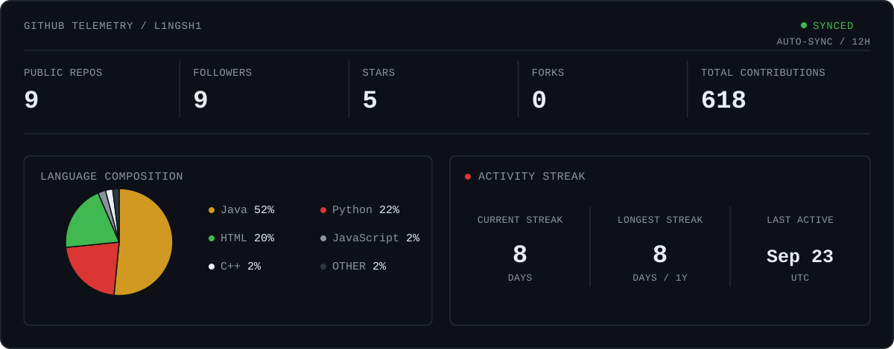

<div align="center">


[](https://git.io/typing-svg)

</div>


### `$ whoami`

```text
name     : L1ngSh1 (Yuze_Yang)
role     : Security Engineer / Researcher
focus    : Agent Security · Program Analysis · Vulnerability Research · Reverse
major    : Cyber Security · Computer Science · Software Engineering · Electrical Engineering
building : Security evaluation and automated analysis systems
research : Indirect prompt injection and trustworthy AI agents（2026.6）
status   : LEARNING · BUILDING · BREAKING
```

I build security tools, reproduce research systems, and study how intelligent agents fail under adversarial conditions.


### Current Research

**01 — Agent Security**<br>
Indirect prompt injection, tool-use risks, agent isolation, and adversarial evaluation.

**02 — Program Analysis**<br>
Static analysis and source-code understanding with compiler and AST infrastructure.

**03 — Vulnerability Evaluation**<br>
Reproducible benchmarks and metrics for security tools and automated vulnerability discovery.

**04 — Offensive Security**<br>
Practical red-team skills grounded in real attack surfaces and defensible research questions.


### GitHub Telemetry

<!-- Auto-generated every 12 hours by .github/workflows/update-github-telemetry.yml. -->




### Security & Engineering Stack

#### Languages


#### Analysis Infrastructure


#### Security Environment


#### Agent & Evaluation Research


### Featured Systems


#### [`01 / Vuln-Eval-Platform`](https://github.com/L1ngSh1/Vuln-Eval-Platform)

**A vulnerability-evaluation platform for analysis systems.** Measures and compares automated security tools through reproducible experiments, explicit metrics, and reviewable evidence.

`Security Evaluation` · `Benchmark` · `Vulnerability Detection`

---

#### [`02 / Arborchive`](https://github.com/L1ngSh1/Arborchive)

**Program-analysis infrastructure for source-level reasoning.** Built with C++ and Clang AST, with a focus on templates, namespaces, class hierarchies, initialization, and explicit source relationships.

`C++` · `Clang` · `LLVM` · `AST` · `Program Analysis`

---

#### [`03 / IPI-Security-Vault`](https://github.com/L1ngSh1/IPI-Security-Vault)

**A reproducible environment for indirect prompt-injection research.** Evaluates attacks against LLM agents and tool-using systems inside controlled Docker-based experiments.

`Agent Security` · `Prompt Injection` · `Docker` · `Android`

---

#### More Systems

- [`ctf-lab`](https://github.com/L1ngSh1/ctf-lab) — practical CTF exercises and offensive-security methodology.

- [`netwatch-cli`](https://github.com/L1ngSh1/netwatch-cli) — lightweight network and system inspection for security-engineering workflows.


### Research Log

```text
[ACTIVE]   Agent security and indirect prompt injection
[BUILDING] Program-analysis infrastructure
[TESTING]  Reproducible vulnerability evaluation
[READING]  Security top-conference research
[TRAINING] Offensive security and CTF methodology
```

### Operating Principles

```text
01  Build systems, not demos.
02  Measure security claims with reproducible evidence.
03  Understand how systems break before claiming they are safe.
```

<picture>
  <source media="(max-width: 600px)" srcset="assets/contact-mobile.svg">
  
</picture>

<p align="center">
  <a href="https://github.com/L1ngSh1"></a>
  &nbsp;&nbsp;
  <a href="mailto:y4n9yuz3@gmail.com"></a>
  &nbsp;&nbsp;
  <a href="https://www.linkedin.com/in/yuze-yang-9a548a3b3/"></a>
</p>


