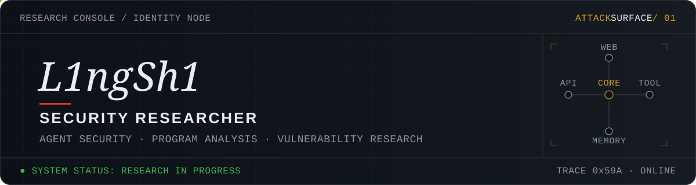
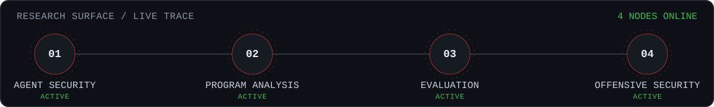
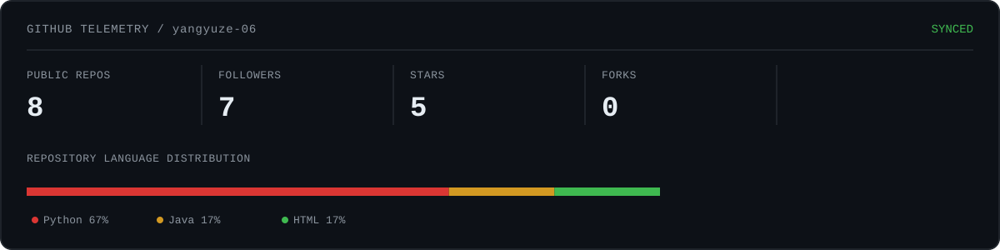
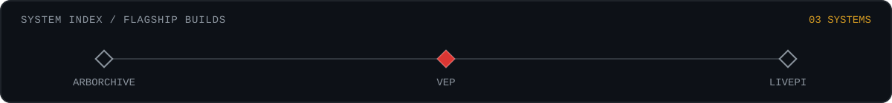
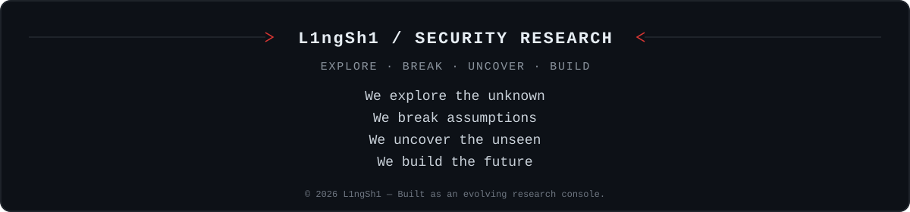

<!--
  PROFILE CONFIGURATION — replace every placeholder before publishing:
  YOUR_GITHUB_USERNAME · YOUR_EMAIL · YOUR_LINKEDIN_URL · YOUR_WEBSITE_URL
  PROJECT_URL_ARBORCHIVE · PROJECT_URL_VEP · PROJECT_URL_LIVEPI
  PROJECT_URL_SECURITY_PAPERS · PROJECT_URL_NETWATCH
-->

<div align="center">



[](https://git.io/typing-svg)

</div>


### `$ whoami`

```text
name     : Yuze
role     : AI Security Researcher
focus    : Agent Security · Program Analysis · Vulnerability Research
building : Security evaluation and automated analysis systems
research : Indirect prompt injection and trustworthy AI agents
status   : LEARNING · BUILDING · BREAKING
```

I build security tools, reproduce research systems, and study how intelligent agents fail under adversarial conditions.



### Current Research

**01 — Agent Security**<br>
Indirect prompt injection, tool-use risks, agent isolation, and adversarial evaluation.

**02 — Program Analysis**<br>
Static analysis and source-code understanding with compiler and AST infrastructure.

**03 — Vulnerability Evaluation**<br>
Reproducible benchmarks and metrics for security tools and automated vulnerability discovery.

**04 — Offensive Security**<br>
Practical red-team skills grounded in real attack surfaces and defensible research questions.


### GitHub Telemetry

<!-- The local dashboard is refreshed daily by .github/workflows/update-dashboard.yml. -->

<div align="center">

[](https://github.com/YOUR_GITHUB_USERNAME)

[](https://github.com/YOUR_GITHUB_USERNAME)

</div>


### Security & Engineering Stack

#### Languages


`JavaScript` · `systems scripting` · `research automation`

#### Analysis Infrastructure


`Clang AST` · `static analysis` · `data flow` · `taint analysis`

#### Security Environment


`Git` · `Frida` · `mitmproxy` · `Nmap`

#### Agent & Evaluation Research

`LLM agents` · `prompt injection` · `security evaluation` · `reproducible experiments`



### Featured Systems

#### [`01 / Arborchive`](PROJECT_URL_ARBORCHIVE)

**Program-analysis infrastructure for source-level reasoning.** Built with C++ and Clang AST, with a focus on templates, namespaces, class hierarchies, initialization, and explicit source relationships.

`C++` · `Clang` · `LLVM` · `AST` · `Program Analysis`

---

#### [`02 / VEP`](PROJECT_URL_VEP)

**A vulnerability-evaluation platform for analysis systems.** Measures and compares automated security tools through reproducible experiments, explicit metrics, and reviewable evidence.

`Security Evaluation` · `Benchmarking` · `Vulnerability Detection`

---

#### [`03 / LivePI Reproduction`](PROJECT_URL_LIVEPI)

**A reproducible environment for indirect prompt-injection research.** Evaluates attacks against LLM agents and tool-using systems inside controlled Docker-based experiments.

`Agent Security` · `Prompt Injection` · `Docker` · `Evaluation`

---

#### More Systems

- [`Security Top-4 Papers`](PROJECT_URL_SECURITY_PAPERS) — structured reading and technical analysis of leading security research.
- [`netwatch-cli`](PROJECT_URL_NETWATCH) — lightweight network and system inspection for security-engineering workflows.


### Research Log

```text
[ACTIVE]   Agent security and indirect prompt injection
[BUILDING] Program-analysis infrastructure
[TESTING]  Reproducible vulnerability evaluation
[READING]  Security top-conference research
[TRAINING] Offensive security and CTF methodology
```

### Operating Principles

```text
01  Build systems, not demos.
02  Measure security claims with reproducible evidence.
03  Understand how systems break before claiming they are safe.
```



<!-- Replace contact placeholders before publishing: YOUR_EMAIL · YOUR_LINKEDIN_URL · YOUR_WEBSITE_URL -->

<div align="center">

[](https://github.com/YOUR_GITHUB_USERNAME)
[](mailto:YOUR_EMAIL)
[](YOUR_LINKEDIN_URL)
[](YOUR_WEBSITE_URL)

</div>


